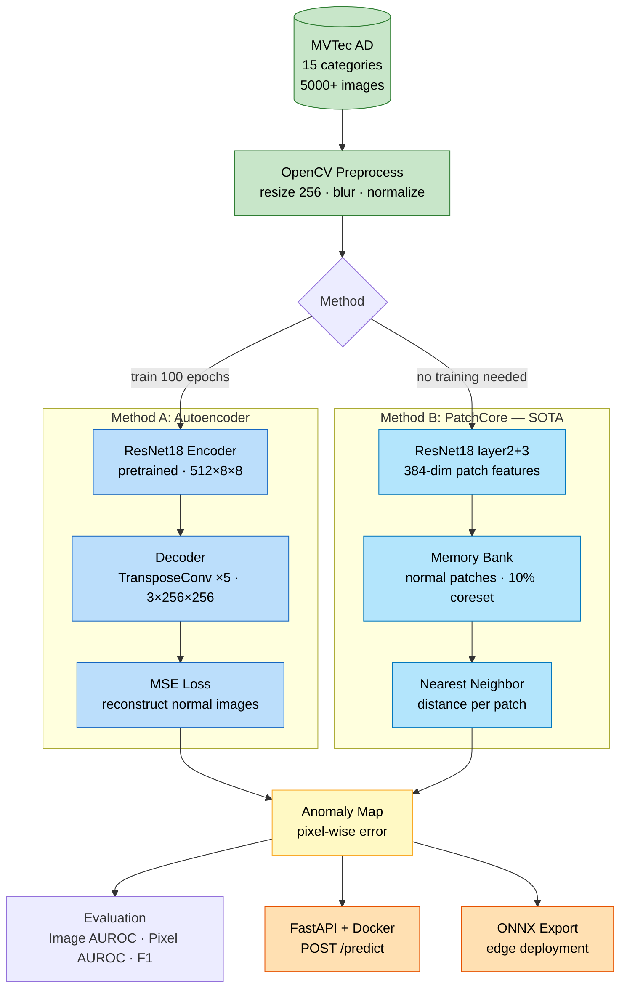
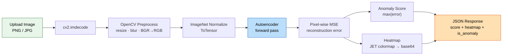
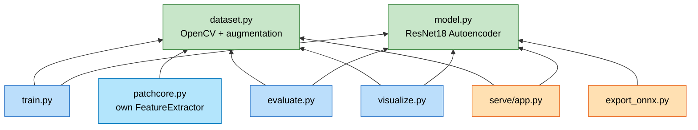

# Industrial Defect Detection — Unsupervised Anomaly Detection


End-to-end manufacturing defect detection system using unsupervised anomaly detection on the [MVTec AD](https://www.mvtec.com/company/research/datasets/mvtec-ad) benchmark. Trains only on **normal (defect-free) images** — no labeled defect data required.

## Highlights

- **Two methods compared**: Autoencoder baseline vs. PatchCore (SOTA), achieving **97%+ pixel-level AUROC**
- **Production-ready**: FastAPI serving + Docker deployment + ONNX export
- **Full preprocessing pipeline**: OpenCV + albumentations data augmentation

---

## Architecture



The system compares two unsupervised approaches: a **reconstruction-based Autoencoder** (learns to reconstruct normal images; defects cause high error) and **PatchCore** (builds a memory bank of normal patch features; defects are far from any known normal patch).

---

## Results

Evaluated on 3 MVTec AD categories (trained on Kaggle T4 GPU):

| Category | Autoencoder |  | PatchCore |  |
|----------|:-----------:|:-----------:|:---------:|:-----------:|
|          | Image AUROC | Pixel AUROC | Image AUROC | Pixel AUROC |
| Bottle   | 0.7992 | 0.3228 | **0.9984** | **0.9770** |
| Carpet   | 0.6364 | 0.6023 | **0.8535** | **0.9760** |
| Hazelnut | 0.9846 | 0.2338 | **0.9968** | **0.9801** |
| **Avg**  | 0.8067 | 0.3863 | **0.9496** | **0.9777** |

**Key insight**: PatchCore dramatically improves pixel-level localization (**0.39 → 0.98** AUROC) because it scores each patch independently via nearest-neighbor distance, rather than relying on global reconstruction quality.

> Run `python src/visualize.py --category bottle` to generate heatmap images in `results/heatmaps/`.

---

## Inference Pipeline



**API endpoints** (FastAPI + Docker):

| Endpoint | Method | Description |
|----------|--------|-------------|
| `/health` | GET | Health check (model loaded? device?) |
| `/predict` | POST | Upload image → anomaly score + heatmap |
| `/load-model` | POST | Switch to different category model |

```bash
# Local
uvicorn serve.app:app --host 0.0.0.0 --port 8000

# Docker
docker-compose up --build

# Test
curl -X POST http://localhost:8000/predict -F "file=@test_image.png"
```

---

## Methods

### Autoencoder (Baseline)

- **Encoder**: Pretrained ResNet18 conv layers → 512-d features at 8×8
- **Decoder**: 5 transposed conv layers → reconstruct 256×256 RGB
- **Anomaly score**: Max pixel-wise MSE; threshold via Youden's J statistic

### PatchCore (SOTA)

- **Features**: ResNet18 layer2 (128-ch) + layer3 (256-ch) → 384-dim patches
- **Memory bank**: Normal training patches, 10% random coreset subsampling
- **Scoring**: Nearest-neighbor L2 distance → upsample + Gaussian smooth (σ=4)

> Reference: *Roth et al., "Towards Total Recall in Industrial Anomaly Detection", CVPR 2022*

---

## Module Map



`dataset.py` and `model.py` are the foundation modules with no local imports. `patchcore.py` has its own `FeatureExtractor` (extracts intermediate ResNet layers) rather than using the autoencoder from `model.py`.

---

## Project Structure

```
defect-detection/
├── README.md
├── requirements.txt
├── docker-compose.yml
├── data/                          # MVTec AD dataset (gitignored)
├── checkpoints/                   # Trained models (gitignored)
├── notebooks/
│   ├── 01_eda.ipynb              # Data exploration + OpenCV showcase
│   └── kaggle_train.ipynb        # Full training notebook (Kaggle GPU)
├── src/
│   ├── dataset.py                # PyTorch Dataset + OpenCV + augmentation
│   ├── model.py                  # ResNet18 Autoencoder
│   ├── patchcore.py              # PatchCore (SOTA method)
│   ├── train.py                  # Training script
│   ├── evaluate.py               # AUROC/F1 evaluation
│   ├── visualize.py              # Anomaly heatmap generation
│   └── export_onnx.py           # ONNX export + benchmark
├── serve/
│   ├── app.py                    # FastAPI inference API
│   └── Dockerfile                # Multi-stage Docker build
└── results/
    └── heatmaps/                 # Generated visualizations
```

## Quick Start

```bash
# 1. Install
pip install -r requirements.txt

# 2. Download MVTec AD → extract to data/
tar xf mvtec_anomaly_detection.tar.xz -C data/

# 3. Train autoencoder (with optional augmentation)
python src/train.py --category bottle --epochs 100 --augment

# 4. Evaluate
python src/evaluate.py --category bottle

# 5. Run PatchCore
python src/patchcore.py --category bottle

# 6. Generate heatmaps
python src/visualize.py --category bottle

# 7. Export to ONNX + benchmark
python src/export_onnx.py --checkpoint checkpoints/bottle_best.pt --benchmark

# 8. Serve API (or: docker-compose up --build)
uvicorn serve.app:app --host 0.0.0.0 --port 8000
```

## Tech Stack

| Component | Technology |
|-----------|-----------|
| Deep Learning | PyTorch, torchvision |
| Image Processing | OpenCV |
| Data Augmentation | albumentations |
| Evaluation | scikit-learn (AUROC, F1, ROC) |
| Serving | FastAPI, uvicorn |
| Deployment | Docker, ONNX Runtime |
| Visualization | matplotlib |

## License

This project uses the [MVTec AD dataset](https://www.mvtec.com/company/research/datasets/mvtec-ad) for academic/research purposes.
