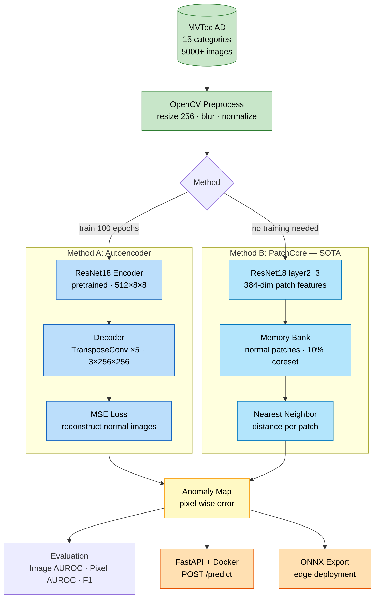
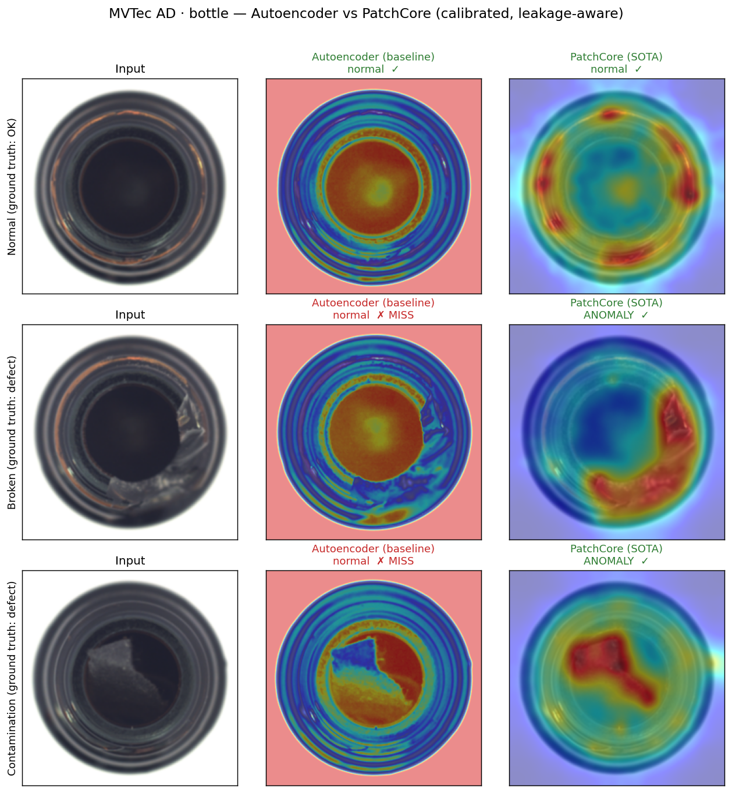
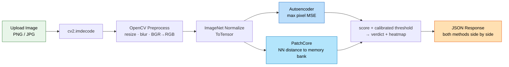
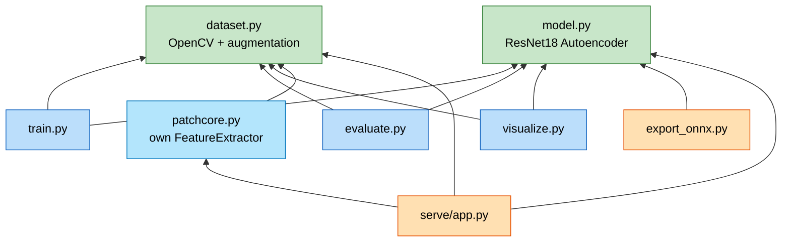

# Industrial Defect Detection — Unsupervised Anomaly Detection


End-to-end manufacturing defect detection system using unsupervised anomaly detection on the [MVTec AD](https://www.mvtec.com/company/research/datasets/mvtec-ad) benchmark. Trains only on **normal (defect-free) images** — no labeled defect data required.

## Highlights

- **Two methods compared**: Autoencoder baseline vs. PatchCore (SOTA), achieving **97%+ pixel-level AUROC**
- **Production-ready**: FastAPI serving + Docker deployment + ONNX export
- **Full preprocessing pipeline**: OpenCV + albumentations data augmentation

---

## Architecture



The system compares two unsupervised approaches: a **reconstruction-based Autoencoder** (learns to reconstruct normal images; defects cause high error) and **PatchCore** (builds a memory bank of normal patch features; defects are far from any known normal patch).

---

## Results

### Headline — `bottle`, calibrated and reproducible locally

Both methods are served side by side. Decision thresholds are calibrated **without
ever touching the test set** — only on held-out normal images (see
[Evaluation notes](#evaluation-notes--honest-limitations)). Metrics are framed in
manufacturing terms, not raw accuracy:

| Method | Image AUROC | Escape rate ↓ | Overkill rate ↓ | Latency (MPS) | Latency (CPU) |
|--------|:-----------:|:------:|:------:|:------:|:------:|
| Autoencoder (baseline) | 0.859 | 38.1% | 5.0% | 13 ms · 78 FPS | 35 ms · 28 FPS |
| **PatchCore (SOTA)** | **1.000** | **1.6%** | **0.0%** | 34 ms · 30 FPS | 57 ms · 18 FPS |

- **Escape rate** = real defects passed as OK (the costly failure in QA).
- **Overkill rate** = good units wrongly scrapped (yield loss).
- Reproduce: `python src/build_patchcore.py && python src/build_ae_threshold.py && python src/benchmark.py`.



The Autoencoder misses both the broken and contamination defects — its error map
fixates on the bottle opening rather than the defect — while PatchCore localises
both. This is why **pixel-level localisation, not image-level accuracy alone,
drives method choice on a production line.**

### Broader benchmark (earlier Kaggle T4 runs)

> Image/pixel AUROC across 3 categories from `src/patchcore.py` (raw, uncalibrated
> eval). Only `bottle` is currently built through the calibrated serving pipeline
> above; re-validating carpet/hazelnut the same way is tracked work.

| Category | AE Image | AE Pixel | PatchCore Image | PatchCore Pixel |
|----------|:--------:|:--------:|:---------------:|:---------------:|
| Bottle   | 0.7992 | 0.3228 | **0.9984** | **0.9770** |
| Carpet   | 0.6364 | 0.6023 | **0.8535** | **0.9760** |
| Hazelnut | 0.9846 | 0.2338 | **0.9968** | **0.9801** |
| **Avg**  | 0.8067 | 0.3863 | **0.9496** | **0.9777** |

**Key insight**: PatchCore dramatically improves pixel-level localization (**0.39 → 0.98** AUROC) because it scores each patch independently via nearest-neighbor distance, rather than relying on global reconstruction quality.

---

## Inference Pipeline

A single `/predict` call scores the image with **both methods** and returns their
calibrated verdicts together, so the quality gap is visible in one response:



**API endpoints** (FastAPI + Docker):

| Endpoint | Method | Description |
|----------|--------|-------------|
| `/health` | GET | Health check (category, device, which methods loaded) |
| `/predict` | POST | Upload image → **AE + PatchCore** scores, calibrated verdicts, heatmaps |
| `/load-model` | POST | Switch category (whitelist-validated; atomic swap of both models) |

```bash
# Local — build artifacts once, then serve
python src/build_patchcore.py   --category bottle
python src/build_ae_threshold.py --category bottle
uvicorn serve.app:app --host 0.0.0.0 --port 8000

# Docker (ResNet18 weights baked in → offline-safe startup)
docker-compose up --build

# Test
curl -X POST http://localhost:8000/predict -F "file=@test_image.png"
```

---

## Methods

### Autoencoder (Baseline)

- **Encoder**: ResNet18 conv layers → 512-d features at 8×8
- **Decoder**: 5 transposed conv layers → reconstruct 256×256 RGB
- **Anomaly score**: Max pixel-wise MSE; threshold calibrated to a target overkill
  rate on held-out normal images (`build_ae_threshold.py`)
- *Intentionally a weak baseline* — see [Evaluation notes](#evaluation-notes--honest-limitations).

### PatchCore (SOTA)

- **Features**: ResNet18 layer2 (128-ch) + layer3 (256-ch) → 384-dim patches
- **Memory bank**: Normal training patches, 10% random coreset subsampling, with a
  disjoint slice of normals held out purely for threshold calibration
- **Scoring**: Nearest-neighbor L2 distance → upsample + Gaussian smooth (σ=4)

> Reference: *Roth et al., "Towards Total Recall in Industrial Anomaly Detection", CVPR 2022*

---

## Evaluation notes & honest limitations

- **No test leakage.** Both thresholds are fit only on normal images; the test set
  is never used for calibration. For **PatchCore** the calibration normals are also
  *held out from the memory bank*, so it is a true held-out calibration. For the
  **Autoencoder** the calibration normals were seen during AE training (the AE is
  trained on all `train/good`), so its threshold is calibrated on training-seen
  normals — no test leakage, but not a clean held-out set. If anything this flatters
  the AE, and PatchCore still wins decisively.
- **The AE is a deliberately weak baseline.** Its training objective has a
  normalisation mismatch (sigmoid output vs. ImageNet-normalised input in the MSE),
  which caps its quality. It is kept as a *reference point*, not a tuned competitor.
- **Single calibration split.** Threshold/escape/overkill come from one random split
  (seed 0, ~41 calibration images); numbers are not yet averaged over seeds.
- **Coverage.** Only `bottle` is built through the calibrated pipeline so far; the
  multi-category table above is from earlier raw `patchcore.py` runs.

---

## Module Map



`dataset.py` and `model.py` are the foundation modules with no local imports. `patchcore.py` has its own `FeatureExtractor` (extracts intermediate ResNet layers) rather than using the autoencoder from `model.py`.

---

## Project Structure

```
defect-detection/
├── README.md
├── requirements.txt
├── docker-compose.yml
├── data/                          # MVTec AD dataset (gitignored)
├── checkpoints/                   # Trained models (gitignored)
├── notebooks/
│   ├── 01_eda.ipynb              # Data exploration + OpenCV showcase
│   ├── kaggle_train.ipynb        # Training code (clean, no outputs)
│   └── kaggle_results.ipynb      # Full results with charts (Kaggle T4)
├── src/
│   ├── dataset.py                # PyTorch Dataset + OpenCV + augmentation
│   ├── model.py                  # ResNet18 Autoencoder
│   ├── patchcore.py              # PatchCore (SOTA method)
│   ├── train.py                  # Training script
│   ├── evaluate.py               # AUROC/F1 evaluation
│   ├── build_patchcore.py        # Build + persist memory bank, calibrate threshold
│   ├── build_ae_threshold.py     # Calibrate AE baseline threshold
│   ├── benchmark.py              # Inference latency / FPS (AE vs PatchCore)
│   ├── make_demo.py              # Render results/demo_comparison.png
│   ├── visualize.py              # Anomaly heatmap generation
│   └── export_onnx.py           # ONNX export + benchmark
├── serve/
│   ├── app.py                    # FastAPI API (serves AE + PatchCore side by side)
│   └── Dockerfile                # Multi-stage build (ResNet18 weights baked in)
└── results/
    └── demo_comparison.png       # AE vs PatchCore demo figure
```

## Quick Start

```bash
# 1. Install
pip install -r requirements.txt

# 2. Download MVTec AD → extract to data/
tar xf mvtec_anomaly_detection.tar.xz -C data/

# 3. Train autoencoder (with optional augmentation)
python src/train.py --category bottle --epochs 100 --augment

# 4. Evaluate
python src/evaluate.py --category bottle

# 5. Build the served artifacts (memory bank + calibrated thresholds)
python src/build_patchcore.py   --category bottle
python src/build_ae_threshold.py --category bottle

# 6. Benchmark + demo figure
python src/benchmark.py --category bottle
python src/make_demo.py

# 7. Serve API (requires step 5; or: docker-compose up --build)
uvicorn serve.app:app --host 0.0.0.0 --port 8000
```

## Tech Stack

| Component | Technology |
|-----------|-----------|
| Deep Learning | PyTorch, torchvision |
| Image Processing | OpenCV |
| Data Augmentation | albumentations |
| Evaluation | scikit-learn (AUROC, F1, ROC) |
| Serving | FastAPI, uvicorn |
| Deployment | Docker, ONNX Runtime |
| Visualization | matplotlib |

## License

This project uses the [MVTec AD dataset](https://www.mvtec.com/company/research/datasets/mvtec-ad) for academic/research purposes.
